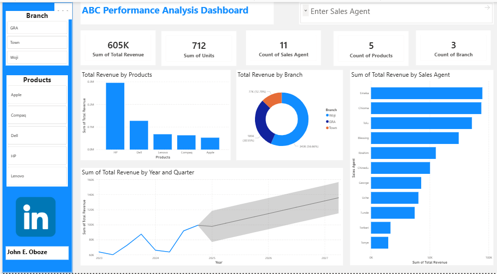

# Data-Analytics-Portfolio
## About Me
hello, my name is John Oboze a Data Anlyst

## Skills
## Data visualization and Reporting (Power BI, Excel & SQL)

I build dashboards and reporting visuals that helps stakeholder make quicker and faster decisions. 
[click here](https://www.linkedin.com/posts/john-ehiabhi-oboze_my-first-project-on-sales-analysis-dashboard-share-7408058048092545024-hyHh/?utm_source=share&utm_medium=member_desktop&rcm=ACoAAB6Qr70B32_ZC4Y2BfMNuyqOd9-uhjLDlDs), and coaching Data Analytics session [click here to view](https://www.linkedin.com/posts/john-ehiabhi-oboze_dataanalytics-dataanalyst-learning-share-7490444474322542592-ayVM/?utm_source=share&utm_medium=member_desktop&rcm=ACoAAB6Qr70B32_ZC4Y2BfMNuyqOd9-uhjLDlDs)

## Projects

i analyze the project with total sales amount $6.18M, Total Propit $1.61M, and Profit Margin $4.54M

## Contacts Detail
